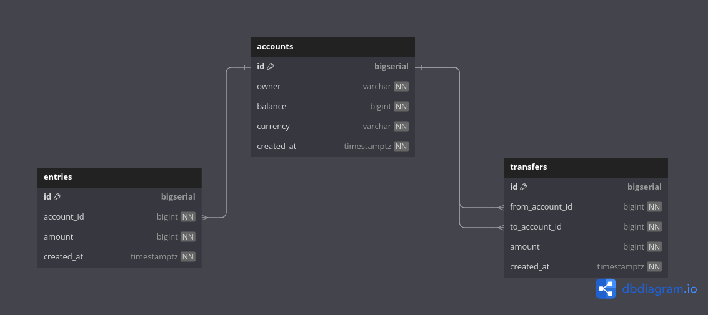
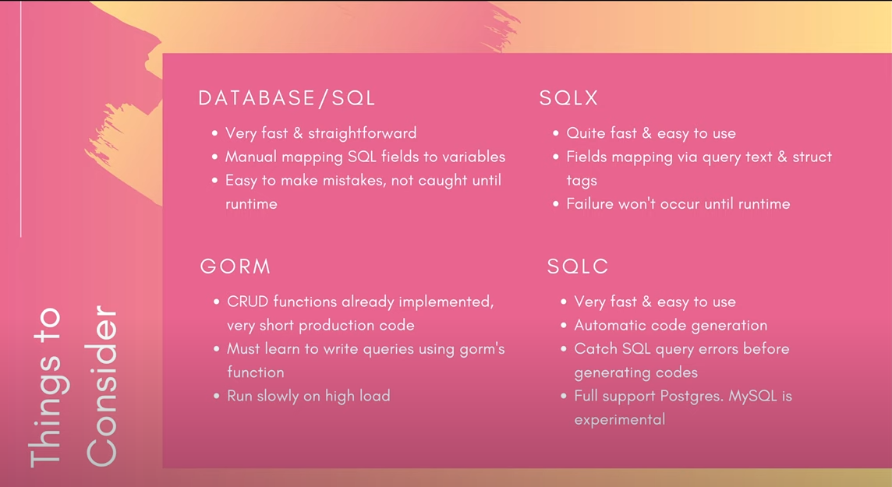
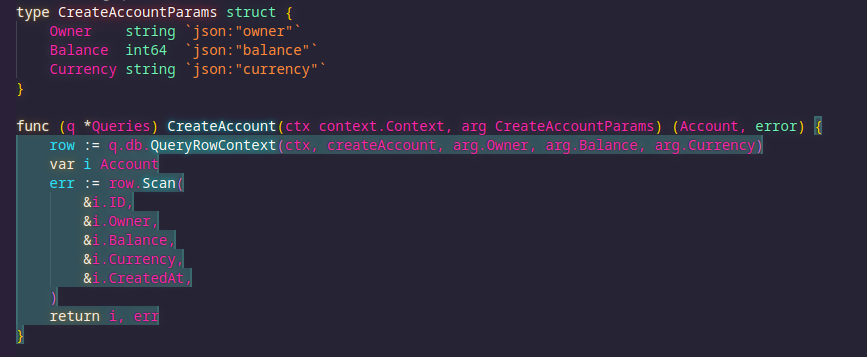
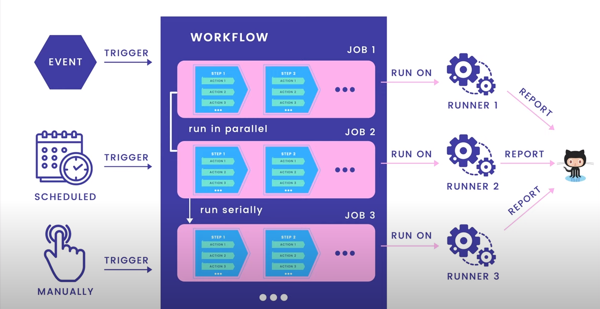

# go-automatic-chainsaw -> bank-app

## Roadmap

#### Section I : Working with database [Postgres]

### 🗒 1. **_[dbdiagram.io](./research_and_development_work/DB_DIAGRAM_SCHEMA.sql) Design DB schema and generate SQL code and PDF as a report._**

<p align='start'>

</p>

<br />
<br />

### 🐳 2. **_[init docker](https://www.docker.com/) create container/images and run for test_**

-   postgres:latest [hub](https://hub.docker.com/_/postgres)
-   run database migration in Golang [golang-migrate](https://github.com/golang-migrate/migrate/tree/master) after this [check ``` migrate --version```]
    <!-- // -->
    ```sh
    mkdir -p db/migration
    migrate create -ext sql -dir db/migration -seq init_schema  #you will see up/down migration files
    ```
    create [Makefile](./Makefile) in your root (to create/drop db with ease)
    ```sh
    make createdb # you should see db by name bank_db
     # after migrate up to find out migration version and stats
    ls -l db/migration
    ```

<br />
<br />

### 🗄️ 3. **_initial type-safe SQL compiler by [sqlc](https://docs.sqlc.dev/en/latest/index.html)_**

also you can use ORM like [GORM](https://gorm.io/index.html) but after some research [like.1](https://blog.jetbrains.com/go/2023/04/27/comparing-db-packages/), [like.2](https://dev.to/fadhilradh/using-sqlc-library-for-golang-projects-will-make-your-life-easier-5474),... we decide to use sqlc

<p align='start'>

</p>

    -   install sqlc

```sh
docker pull sqlc/sqlc #then use docker run ...
#or
yay sqlc
```

then init sqlc and generate sqlc config like [here](./sqlc.yaml) , `insure use postgres config`

then create all needed schemas files [like here](./db/schema/) and queries files [like here](./db/query/) based on your db [find sample here](https://docs.sqlc.dev/en/latest/tutorials/getting-started-postgresql.html)

then run

```sh
make sqlc # after this ./db/sqlc directory should contain generated go files [account/entry/transfer/.../db/model]
```

then you can write your own custom query like [AddAccountBalance](./db/query/account.sql) or default standard CRUD and enjoy

<br />
<br />

### 🧪 4. **_init Unit test by [testify](https://github.com/stretchr/testify)_**

```sh
go get github.com/stretchr/testify #install package
go mod tidy #to update all used packages
```

then init your [main_test.go](./db/sqlc/main_test.go) for all test connection to db

now you can your test by sample for your [account CRUD](./db/sqlc/account_test.go) like this.

then run

```sh
make test # run all test by coverage
```

after run you can check success coverage code by highlights

<p align='start'>

</p>

<br />

### 👨‍💻 5. **_init CI/CD github Actions_**

-   to init git hub actions fot `GO` see [the doc](https://docs.github.com/en/actions/automating-builds-and-tests/building-and-testing-go)
-   then you need to setup `postgres` in your ci config [see doc](https://docs.github.com/en/actions/using-containerized-services/creating-postgresql-service-containers)
-   then you need to setup `migration` in your ci config [see doc](https://github.com/golang-migrate/migrate/tree/master/cmd/migrate)

<p align='start'>

</p>

final config should look like [this](./.github/workflows/ci.yml)

<br />

### 🍸 6. **_Implement RESTful HTTP API using [Gin](https://gin-gonic.com/docs/quickstart/)_**

-   after install gin :
    -   create api folder and [server.go](./api/server.go) file for base service configuration
    -   create main.go [main.go](./main.go) file in root to init go for db,server
    -   after `make server` you can use [Thunder Client](https://www.thunderclient.com/) or [postman](https://www.postman.com/) to check and test api

<br />

### ⚙️ 7. **_Extra Configurations_**

-   install [viper](https://github.com/spf13/viper) as a configuration file solution.

    ```shell
    go get github.com/spf13/viper
    ```

    then create [app.env](./app.env) file to define configs.
    and [config.go](./utils/config.go) file to load configs in app

<br />
